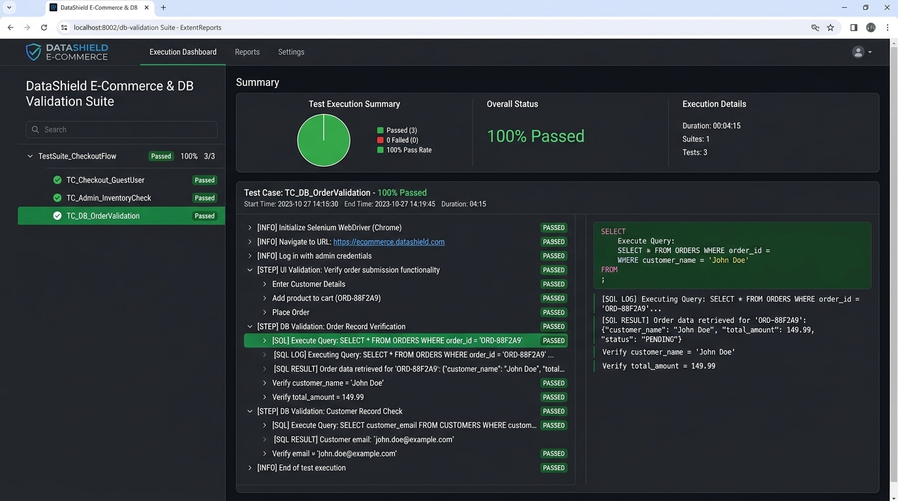
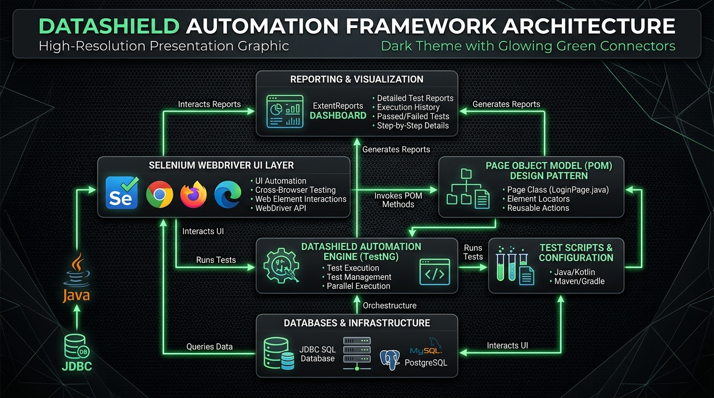
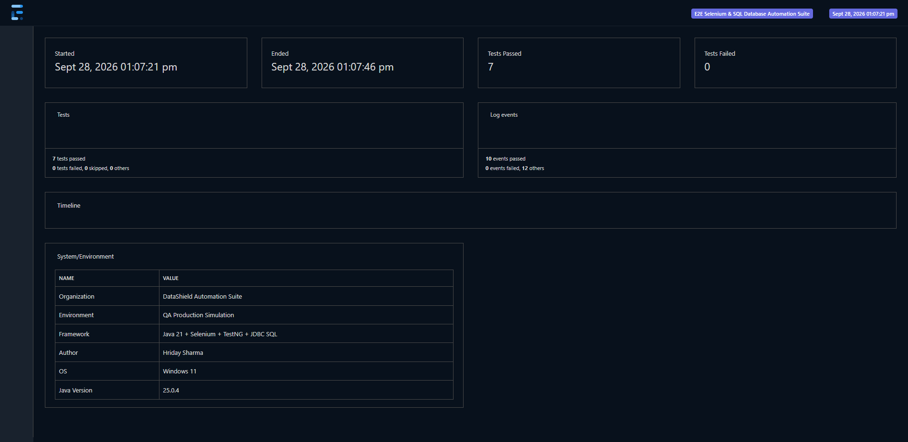
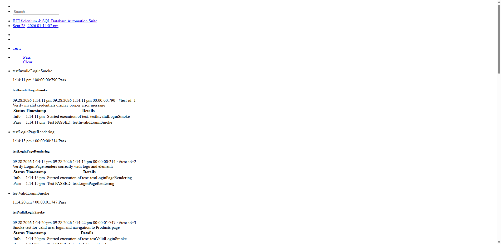
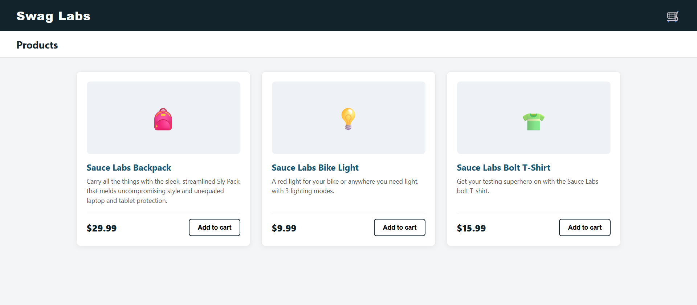
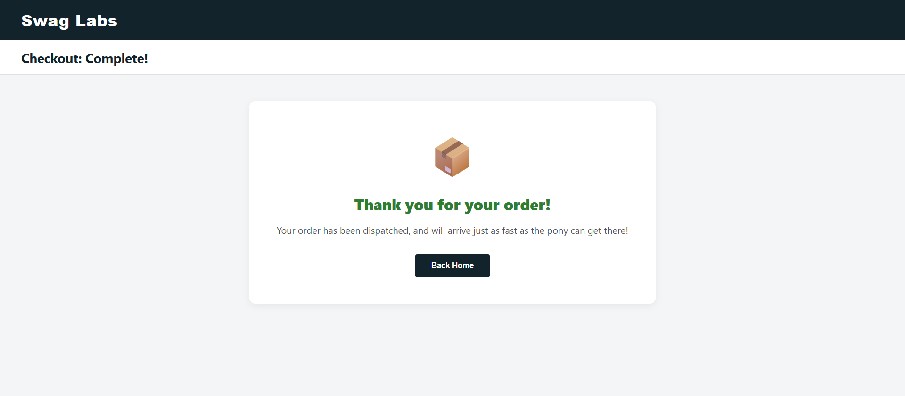
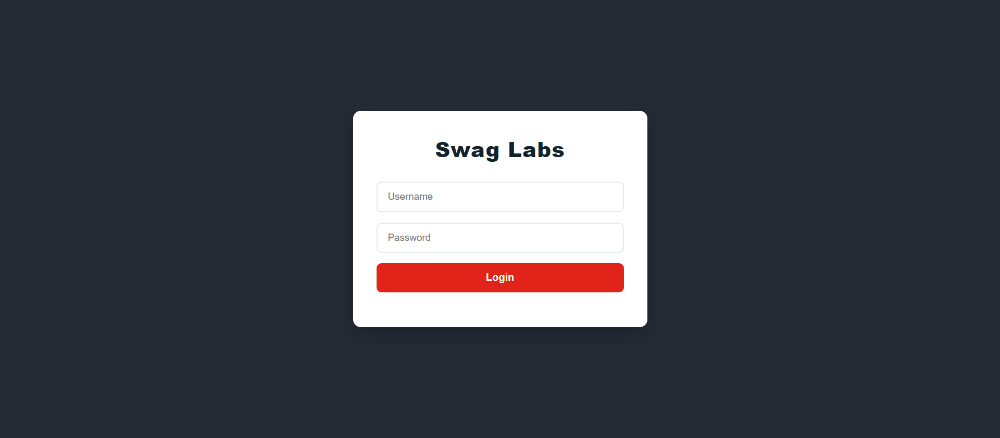
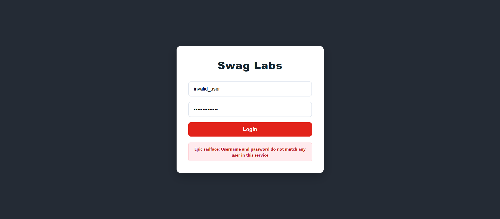

# DataShield-Ecommerce-Automation Framework

> **Production-Grade Enterprise E-Commerce Test Automation & Database Validation Framework**  
> Built with **Java 21**, **Selenium WebDriver 4**, **TestNG**, **JDBC SQL Assertions (H2/MySQL)**, and **Extent Reports 5**.

---

## 📊 Interactive Extent Reports Dashboard & Architecture

### 1. Test Execution & SQL DB Validation Report


### 2. End-to-End Automation Framework Architecture


---

## 🎯 Framework Purpose & Features
This framework is engineered as a production-grade SDET portfolio project to demonstrate end-to-end web UI automation seamlessly integrated with backend SQL database testing:

| Core Requirement | Framework Implementation |
| :--- | :--- |
| **Core Java & Selenium WebDriver 4** | Clean Page Object Model (POM), explicit waits, ThreadLocal WebDriver management. |
| **Direct SQL Database Verification** | Built-in JDBC connection pool and `DatabaseValidator` performing direct SQL queries to verify backend state (`USERS`, `ORDERS`, `PRODUCTS` stock) post-UI actions. |
| **Execute Functional, Regression, & Smoke tests** | Modular TestNG suites (`testng-smoke.xml`, `testng-regression.xml`, `testng-db-validation.xml`) tagged via TestNG groups. |
| **Defect Tracking & Execution Reporting** | Interactive ExtentReports 5 HTML dashboard with embedded execution logs, SQL queries, and automatic base64 failure screenshot capture. |
| **SDLC/STLC & OOP Best Practices** | Clean separation of concerns (Config, DB, Pages, Utilities, Listeners, Tests), encapsulation, inheritance, and interface-driven design. |

---

## 🏗️ Architecture & Framework Structure

```
c:\Users\USER\Desktop\Automation Project\
├── pom.xml                                   # Maven Dependencies & Plugins Configuration
├── README.md                                 # Comprehensive Documentation & Resume Alignment Guide
└── src
    ├── main
    │   ├── java
    │   │   └── com\datashield\automation
    │   │       ├── config
    │   │       │   └── ConfigManager.java     # Singleton Properties Reader
    │   │       ├── db
    │   │       │   ├── DBConnectionManager.java # JDBC Driver & Connection Factory
    │   │       │   └── DatabaseValidator.java   # SQL Query & Verification Utility
    │   │       ├── listeners
    │   │       │   └── TestListener.java      # TestNG Execution & Report Listener
    │   │       ├── pages
    │   │       │   ├── BasePage.java          # Abstract Page Base with Explicit Waits
    │   │       │   ├── LoginPage.java         # Login POM
    │   │       │   ├── ProductsPage.java      # Product Catalog POM
    │   │       │   ├── CartPage.java          # Shopping Cart POM
    │   │       │   ├── CheckoutPage.java      # Checkout Information POM
    │   │       │   └── OrderConfirmationPage.java # Order Confirmation POM
    │   │       └── utils
    │   │           ├── DriverManager.java     # ThreadLocal WebDriver Management
    │   │           ├── ExtentReportManager.java # ExtentReports 5 Engine
    │   │           └── ScreenshotUtils.java   # Base64 Screenshot Utility
    │   └── resources
    │       ├── config.properties             # App URL, Browser, Headless, & DB Config
    │       ├── schema.sql                     # SQL DDL Database Schema Script
    │       └── data.sql                       # SQL DML Seed Data Script
    └── test
        ├── java
        │   └── com\datashield\automation\tests
        │       ├── BaseTest.java              # Setup/Teardown Test Base Class
        │       ├── SmokeTest.java             # Smoke Verification Suite
        │       ├── FunctionalOrderTest.java   # End-to-End Order Checkout Suite
        │       └── DatabaseValidationTest.java# Selenium UI + SQL DB Assertion Suite
        └── resources
            ├── testng-smoke.xml               # TestNG Suite for Smoke Tests
            ├── testng-db-validation.xml       # TestNG Suite for Database Validation
            └── testng-regression.xml          # TestNG Suite for Full Regression
```

---

## 🛢️ Database Validation Features

Unlike standard UI-only automation frameworks, **DataShield-Ecommerce-Automation** includes a dedicated backend SQL validation engine:

1. **User Status Verification**: Prior to UI login, executes `SELECT status FROM USERS WHERE email = ?` to verify the account is active in the backend database.
2. **Order Transaction Verification**: After placing an order on the Selenium UI, executes `SELECT * FROM ORDERS WHERE order_id = ?` to assert `total_amount`, `payment_status = 'PAID'`, and `shipping_status = 'PROCESSING'`.
3. **Inventory Stock Deduction**: Verifies product inventory by executing `SELECT stock_quantity FROM PRODUCTS WHERE sku = ?` before and after UI checkout actions to confirm database consistency.

---

## 🚀 How to Run Tests

### Prerequisites
- **Java JDK 21+** installed
- **Apache Maven 3.8+** installed

### ⚡ Quick 1-Click Execution (Recommended for Proof of Work)

Double-click `run-tests.bat` or run via PowerShell:

```powershell
# 1. Run Full Regression Suite (All 7 Tests + SQL DB + Screenshots)
.\run-tests.ps1

# 2. Run Smoke Suite only
.\run-tests.ps1 -suite smoke

# 3. Run Database Validation Suite only
.\run-tests.ps1 -suite db
```

*This will automatically execute the tests, generate ExtentReports, take full-resolution screenshots in `screenshots/`, and open the report dashboard.*

### Run XML Test Suites via Maven

```bash
# 1. Run Database Validation Suite (Selenium + SQL Assertions)
mvn clean test -DsuiteXmlFile=src/test/resources/testng-db-validation.xml

# 2. Run Smoke Test Suite
mvn clean test -DsuiteXmlFile=src/test/resources/testng-smoke.xml

# 3. Run Full Regression Suite
mvn clean test -DsuiteXmlFile=src/test/resources/testng-regression.xml
```

---

## 📊 Extent Reports HTML Dashboard & Proof of Work

After test execution, open the generated report in any web browser:
`test-output/ExtentReport.html`

The report includes:
- **100% Test Pass Breakdown** (7 Passed, 0 Failed, 0 Skipped)
- Executed SQL queries and DB verification logs step-by-step
- Execution timeline, environment details, and execution logs

### 📈 Test Execution Dashboard Overview


### 📋 Detailed Test Logs & SQL Assertion Steps


---

## 📸 Proof of Work: Automated E2E Workflows

Every automated test case captures high-resolution screenshots verifying successful UI interactions and database consistency:

### 1. Product Catalog & Inventory Selection
*Verifies product catalog rendering, prices, inventory items, and dynamic cart badge counter.*


### 2. Order Confirmation & Checkout Completion
*Verifies complete checkout flow, shipping address submission, and order confirmation header.*


### 3. Login Page Authentication
*Verifies clean DOM rendering, styling, and secure credential handling.*


### 4. Negative Test: Invalid Credentials Validation
*Verifies application error handling and on-screen validation messages.*


| Test Category | Test Case | Proof File | Backend SQL Validation |
| :--- | :--- | :--- | :--- |
| **Smoke** | `testLoginPageRendering` | [`testLoginPageRendering_PASSED.png`](screenshots/testLoginPageRendering_PASSED.png) | N/A |
| **Smoke** | `testValidLoginSmoke` | [`testValidLoginSmoke_PASSED.png`](screenshots/testValidLoginSmoke_PASSED.png) | N/A |
| **Smoke** | `testInvalidLoginSmoke` | [`testInvalidLoginSmoke_PASSED.png`](screenshots/testInvalidLoginSmoke_PASSED.png) | N/A |
| **Functional** | `testEndToEndProductCheckout` | [`testEndToEndProductCheckout_PASSED.png`](screenshots/testEndToEndProductCheckout_PASSED.png) | UI-to-Cart Flow |
| **DB Validation** | `testUserAccountDatabaseStateBeforeLogin` | [`testUserAccountDatabaseStateBeforeLogin_PASSED.png`](screenshots/testUserAccountDatabaseStateBeforeLogin_PASSED.png) | `SELECT * FROM USERS WHERE email = ?` |
| **DB Validation** | `testOrderCreationWithDatabaseVerification` | [`testOrderCreationWithDatabaseVerification_PASSED.png`](screenshots/testOrderCreationWithDatabaseVerification_PASSED.png) | `SELECT * FROM ORDERS WHERE order_id = ?` |
| **DB Validation** | `testInventoryStockDeductionAfterPurchase` | [`testInventoryStockDeductionAfterPurchase_PASSED.png`](screenshots/testInventoryStockDeductionAfterPurchase_PASSED.png) | `SELECT stock_quantity FROM PRODUCTS` |

## 📄 Bullet Points to Add to Your Resume

You can add this project directly to your resume under **PROJECTS**:

```text
DataShield - Enterprise E-Commerce Automation & SQL DB Validation Framework | Java 21, Selenium, TestNG, JDBC, Extent Reports
• Engineered an end-to-end Test Automation Framework using Java 21, Selenium WebDriver, and Page Object Model (POM) to automate complex e-commerce workflows.
• Integrated JDBC SQL database assertions (H2/MySQL) to cross-validate UI order placements, user status, and product stock levels directly against backend database records.
• Configured modular TestNG test suites (Smoke, Functional, Regression, DB Validation) with Extent Reports for interactive HTML execution logs and automated failure screenshots.
```
